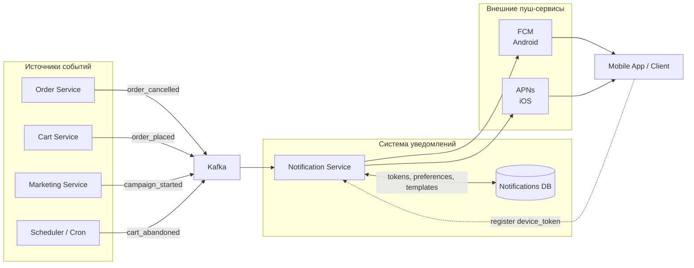

# Архитектура отправки PUSH-уведомлений

```mermaid
flowchart LR
    subgraph Sources [Источники событий]
        Order[Order Service]
        Cart[Cart Service]
        Marketing[Marketing Service]
        Scheduler[Scheduler / Cron]
    end

    Kafka[Kafka]

    subgraph NotifSystem [Система уведомлений]
        Notif[Notification Service]
        NotifDB[(Notifications DB)]
    end

    subgraph External [Внешние пуш-сервисы]
        FCM[FCM<br/>Android]
        APNs[APNs<br/>iOS]
    end

    Client[Mobile App / Client]

    Order -->|order_cancelled| Kafka
    Cart -->|order_placed| Kafka
    Marketing -->|campaign_started| Kafka
    Scheduler -->|cart_abandoned| Kafka

    Kafka --> Notif
    Notif <-->|tokens, preferences, templates| NotifDB

    Notif --> FCM
    Notif --> APNs
    FCM --> Client
    APNs --> Client

    Client -.->|register device_token| Notif
```
